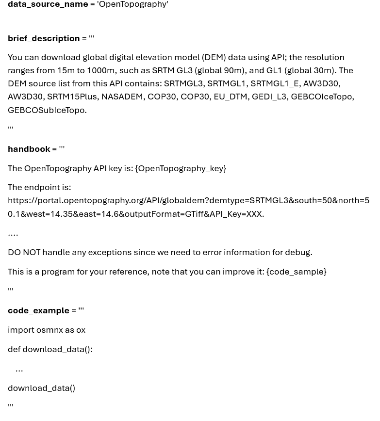
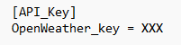

# You can add your customized data source by adding an associated handbook following these requirements.

# Creating a handbook with the Handbook Studio (recommended)
On the ```Add New Data Source``` tab, click ```Create a handbook (with AI or manually)...``` to open the Handbook Studio.

* **Generate with AI**: describe the data source or the data you need (or paste an API/documentation link) and click ```Generate handbook```. The AI finds the official source, reads its documentation, and writes the handbook and a code example. With the test option ticked, it also runs the code example as a small sample download in a separate Python process and fixes it if it fails.
  * With an **OpenAI API key** (`sk-...`), the AI searches the web for the documentation.
  * With a **GIBD API key**, web search is not available, so the AI relies on its own knowledge and on the documentation URLs you enter. Adding the documentation URL helps a lot.
* **Write manually**: start a blank handbook, open an existing one (built-in or yours) to adapt it, or import a `.toml` file.
* **Ask the AI to revise the draft**: type a change (e.g. "save the output as GeoJSON") or paste an error message, and the AI updates the handbook.
* **Test code** runs the code example once; **Save handbook** makes the data source available to the agent immediately.

## API keys (same convention as GIS Co-Scientist)
If the data source needs credentials, tick ```This data source needs an API key``` and enter the **key names** the provider uses, e.g. `FIRMS_MAP_KEY` (comma-separated if it needs several, e.g. `EOG_CLIENT_ID, EOG_CLIENT_SECRET`), then enter each value.

* In the handbook, `key_name = "FIRMS_MAP_KEY"` declares the credential; the values are stored in `<SourceID>.keys` under `[API_Key]`, never in the handbook.
* The code example reads the key with `os.environ["FIRMS_MAP_KEY"]`. When data is requested, the plugin puts the stored values into environment variables while the generated code runs.
* The handbook text may write `{FIRMS_MAP_KEY}` where the value belongs (e.g. in a URL or header); it is replaced with the stored value.
* Keys can also be entered or changed in the ```Data Sources API Keys``` table: one row per credential, labelled `SourceID : KEY_NAME`.

Older handbooks that use a `{<SourceID>_key}` placeholder keep working unchanged.

Handbooks you create or import are saved in your QGIS profile folder, `AutonomousGIS_GeodataRetrieverAgent_data/Handbooks` (keys in `.../Keys`), outside the plugin folder, so they are kept when the plugin is updated. A handbook of yours with the same ID as a built-in one replaces the built-in one.

The rest of this page describes the handbook format, for writing or editing handbooks by hand.

# Handbook format

A handhook consists of three required parts: `data_source_name`, `brief_dexription`, and `handbook`, being stored as a `.toml` format.

## `data_source_name`
A short, meaningful, and human readable name, for example, `OpenStreetMap`', `US_Census_demography`, `US_Census_boundary`, `OpenTopography`, `OpenWeather`, `COVID_NYT`, and `ESRI_world_imagery`. 

## `brief_description`
Provide a brief description (1 line) of the data source to inform AI when to use this data source. Need to contain critical information such as extent and period. E.g., the `brief_description` for `COVID_NYT` data source is `US COVID-19 data by New York Times. Cumulative counts of COVID-19 cases and deaths in the United States, at the state and county level, over time from 2020-01-21 to 2023-03-23.`.

## `handbook`
Put the technical requirements or details for the data source. One line for a requirement. No need to number them. For example: 

`The COVID-19 cumulative death and case data can be accessed via: https://raw.githubusercontent.com/nytimes/covid-19-data/master/us-counties-{year}.csv, year can be 2021, 2022,and 2023.`

`The CSV columns are: date,county,state,fips,cases,deaths. The data line can be: 2020-01-21,Washington,53,1,0. Note that the data-type of "fips" column is string, while the "case" and "deaths" are integer. You need to store the data type correctly. `

`Put your reply into a Python code block. Explanation or conversation can be Python comments at the begining of the code block(enclosed by ```python and ```). The download code is only in a function named 'download_data()'. The last line is to execute this function.`

## An example of handbook


The most important work for a customized data source is making a workable handbook. We recommend you start with very simple requirements, and then use LLM-Find the test many cases to see what kind of error occurs, then refine or add more requirements. After you have finish the handbook, you can share it with friends or colleagues, so that their LLM-Find agent can access the data source very easy with natural language requests. 

## How to use API keys
Many data sources require API keys  to access. You need to store the keys separately for each source. For example, put the key for the data source of `OpenWeather` in the file of `OpenWeather.keys` in the `Keys` directory. E.g.,

You need to replace the `XXX` using your real key and name the key. In the requirements in the `handbook`, you need to use a placeholder as `{OpenWeather}` to indicate the API key. LLM-Find will replace that placeholder using the key in the `OpenWeather.keys` file. 

## How to use code example and other variables in a handbook
Similar to API key, you need a placeholder in the requirements in a handbook. For example, there is a requirement of `This is a program for your reference, note that you can improve it: {code_example}` in the `US_Census_demography.toml`, the placeholder of `{code_example}` will be replaced by the variable of `code_example` in the toml file. Also the placeholder of `{Census_variables}` will be replaced by the variable of `Census_variables` in the same toml file. Such a design aims to better organize and maintain the requirements in the handbook.

You need to replace the `XXX` using your real key and name the key. In the requirements in the `handbook`, you need to use a placeholder as `{OpenWeather}` to indicate the API key. LLM-Find will replace that placeholder using the key in the `OpenWeather.keys` file.  


# Handbook organization
All handbooks are stored in the `Handbooks` directory, and the associated API keys are stored in the `Keys` directory. 

# How to add a new data source documentation file to the agent
To add a handbook file (.toml) you already have, for example one shared by a colleague or downloaded from a data source card, open the Handbook Studio (```Add New Data Source``` > ```Create a handbook (with AI or manually)...```), choose ```Write manually``` > ```Import a .toml file...```, review it and press ```Save handbook```. It is saved in your QGIS profile folder (`AutonomousGIS_GeodataRetrieverAgent_data/Handbooks`), so plugin updates keep it. You can also copy the file into that folder directly.

# How to add a key associated to a data source (if needed)
Many data sources require API keys to access. This can also be added within the plugin by following these processes described below:
* On the ```Add New Data Source``` panel, select the ```+``` button on the New key tab


* On the ```Add New Key``` dialog box, enter the key name and the key and click save. **Note: The key name must be same with the corresponding data source name. For example, the key name for ```OpenStreetMap.toml``` data source documentation must be ```OpenStreetMap```**


* The new Key will be added to the local machine (C:\Users\AKINBOYEWA TEMITOPE\AppData\Roaming\QGIS\QGIS3\profiles\default\python\plugins\AutonomousGIS_GeodataRetrieverAgent\LLM_Find\Keys) and will be automatically added to the Data source API keys panel.


* Additionally, user can remove any API automatically by using the ```-``` button on the New Key tab. 
* Also, if there is a need to add/remove a row manually within the ```Data Sources API Keys``` panel, user can use the New rows buttons (i.e ```+``` and ```-```).

